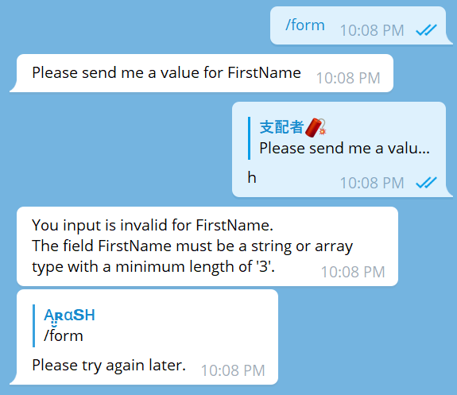

# TelegramUpdater, FMF ( Fill my form )

This is an extension package for TelegramUpdater to help you fill a form in a
blink of an eye.

## How ?

FMF uses `Channels` feature of TelegramUpdater to open a realtime channel between
your bot and a target user.

FMF will ask from a user and the user will respond ( probably ). and meanwhile
your form is getting filled.

## Let's Start

I'm gonna start with a simple form that has 3 felids: `FirsName`, `LastName` and
`Age`.

First of all, create your form using a normal class.

```csharp
// MySimpleForm.cs
internal class MySimpleForm
{
    public string FirstName { get; set; } = null!;

    public string? LastName { get; set; } // can be null, It's Nullable!

    public int Age { get; set; }

    public override string ToString()
    {
        return string.Format("{0} {1}, {2} years old.", FirstName, LastName?? "", Age);
    }
}
```

### ! Considerations

- > Target properties should be: `public`, `Readable` and `Writeable`
  > ( both `get` and `set` )

- > Form class **Should** have a parameterless constructor.

A useable form should implement `IForm` interface!
But `AbstractForm` is what you need.

Make your form a sub-class of `AbstractForm` and implement abstract methods.

```csharp
// MySimpleForm.cs
internal class MySimpleForm : AbstractForm
{
    public string FirstName { get; set; } = null!;

    public string? LastName { get; set; } // can be null, It's Nullable!

    public int Age { get; set; }

    public override string ToString()
    {
        return string.Format("{0} {1}, {2} years old.", FirstName, LastName?? "", Age);
    }

    public override async Task OnBeginAskAsync<TForm>(FormFillterContext<TForm> fillterContext, CancellationToken cancellationToken)
    {
        throw new NotImplementedException();
    }

    public override Task OnSuccessAsync<TForm>(FormFillterContext<TForm> fillterContext, OnSuccessContext onSuccessContext, CancellationToken cancellationToken)
    {
        throw new NotImplementedException();
    }
}
```

The things that are less requirements, are to **ask the user** and **notify him if
input was successful**

This things are possible using `OnBeginAskAsync` and `OnSuccessAsync` methods.

> There are more methods like these to handle different conditions. but these are
> less required methods.

Let's apply a simple implementation for `OnBeginAskAsync`.

```csharp
public override async Task OnBeginAskAsync<TForm>(FormFillterContext<TForm> fillterContext, CancellationToken cancellationToken)
{
    await fillterContext.SendTextMessageAsync(
        $"Please send me a value for {fillterContext.PropertyName}",
        replyMarkup: new ForceReplyMarkup(),
        cancellationToken: cancellationToken);
}
```

> You can customize this the way you like. ( different texts based on property name )

For now i don't want to say anything on partial successes. Therefor:

```csharp
public override Task OnSuccessAsync<TForm>(FormFillterContext<TForm> fillterContext, OnSuccessContext onSuccessContext, CancellationToken cancellationToken)
{
    return Task.CompletedTask;
}
```

Create an scoped update handler for `/form` Command.

```csharp
// FormHandler.cs
using Telegram.Bot.Types;
using TelegramUpdater;
using TelegramUpdater.FillMyForm;
using TelegramUpdater.UpdateContainer;
using TelegramUpdater.UpdateHandlers.ScopedHandlers.ReadyToUse;

namespace QuickExample;

[ApplyFilter(typeof(FormStartFilter))]
internal class FormHandler : ScopedMessageHandler
{
    protected override async Task HandleAsync(IContainer<Message> updateContainer)
    {
        var filler = new FormFiller<MySimpleForm>(
            updateContainer.Updater,
            defaultCancelTrigger: new MessageCancelTextTrigger());

        var form = await filler.FillAsync(updateContainer.Sender()!);

        if (form is not null)
        {
            await updateContainer.Response($"Thank you, {form}");
        }
        else
        {
            await updateContainer.Response($"Please try again later.");
        }
    }
}

// Create filter.
class FormStartFilter : Filter<Message>
{
    // Filter message text like /form
    public FormStartFilter() : base(FilterCutify.OnCommand("form")) { }
}
```

Go to `Program.cs` and setup your `Updater`.

```csharp
// Program.cs
using QuickExample;
using Telegram.Bot;
using TelegramUpdater;

await new Updater(new TelegramBotClient("BotToken"))
    .AddScopedMessage<FormHandler>()
    .StartAsync();
```

Run the app and send `/form` command to your bot.

### Add a cancel trigger

Cancel triggers are responsible for cancel request like `/cancel`.

Simplest way to add a cancel trigger for `/cancel` is to use `MessageCancelTextTrigger`
(which is a ready-to-use cancel trigger) and `FormPropertyAttribute`.

Place attribute on your properties.

```csharp
// MySimpleForm.cs
// -- sniff --

internal class MySimpleForm : AbstractForm
{
    [FormProperty(CancelTriggerType = typeof(MessageCancelTextTrigger))]
    public string FirstName { get; set; } = null!;

    [FormProperty(CancelTriggerType = typeof(MessageCancelTextTrigger))]
    public string? LastName { get; set; } // can be null, It's Nullable!

    [FormProperty(CancelTriggerType = typeof(MessageCancelTextTrigger))]
    public int Age { get; set; }

// -- sniff --
```

Run the app again and try sending `/cancel` while filling a form.

### Default cancel trigger

You can also use a default cancel trigger which will be used for all of properties
if they has no any cancel triggers already.

```csharp
var filler = new FormFiller<MySimpleForm>(
    updateContainer.Updater,
    defaultCancelTrigger: new MessageCancelTextTrigger());
```

### Make a property Required

Simply use `[Required]` from `System.ComponentModel.DataAnnotations`.

```csharp
// MySimpleForm.cs
// -- sniff --

internal class MySimpleForm : AbstractForm
{
    [Required]
    [FormProperty(CancelTriggerType = typeof(MessageCancelTextTrigger))]
    public string FirstName { get; set; } = null!;

    [FormProperty(CancelTriggerType = typeof(MessageCancelTextTrigger))]
    public string? LastName { get; set; } // can be null, It's Nullable!

    [Required]
    [FormProperty(CancelTriggerType = typeof(MessageCancelTextTrigger))]
    public int Age { get; set; }

// -- sniff --
```

Now try using `/cancel` on required properties and see the form fails.

### Other validations

You can set other limitation for user inputs. Eg: MaxLength for string.

```csharp
// MySimpleForm.cs
// -- sniff --

[Required]
[MinLength(3)]
[MaxLength(32)]
public string FirstName { get; set; } = null!;

[MinLength(3)]
[MaxLength(32)]
public string? LastName { get; set; } // can be null, It's Nullable!

[Required]
[Range(13, 120)]
public int Age { get; set; }

// -- sniff --
```

At this point you better implement another method to handle invalid inputs response.
The method is `OnValidationErrorAsync`.

I implemented it this way:

```csharp
public override async Task OnValidationErrorAsync<TForm>(FormFillterContext<TForm> fillterContext, ValidationErrorContext validationErrorContext, CancellationToken cancellationToken)
{
    if (validationErrorContext.RequiredItemNotSupplied)
    {
        await fillterContext.SendTextMessageAsync(
            $"{fillterContext.PropertyName} was required! You can't just leave it.");
    }
    else
    {
        await fillterContext.SendTextMessageAsync(
            $"You input is invalid for {fillterContext.PropertyName}.\n" +
            string.Join("\n", validationErrorContext.ValidationResults.Select(
                x => x.ErrorMessage)));
    }
}
```

Go ahead! run the bot, try some invalid stuff and watch.



### Add retry options

You can add retry option for a property. it means the bot will try again if
something gets invalid.

```csharp
[Required]
[MinLength(3)]
[MaxLength(32)]
[FillPropertyRetry(FillingError.ValidationError, 2)]
public string FirstName { get; set; } = null!;
```

Now user has two more chances if he/she fails.

## What's next?

### More control

You can implement more response methods to get more control.
  
- `OnTimeOutAsync`
- `OnConversationErrorAsync`
- `OnUnrelatedUpdateAsync`
- `OnCancelAsync`

### God like control

In the most advanced use of package you can handle more complex conversations.
As instance you may want to show a menu to the user using inline buttons and catch the
response.

It's possible using `UpdateCrackers`.

Take a look at [SurveyBot](Examples/SurveyBot). Crackers are added in handler
( `Program.cs` )
